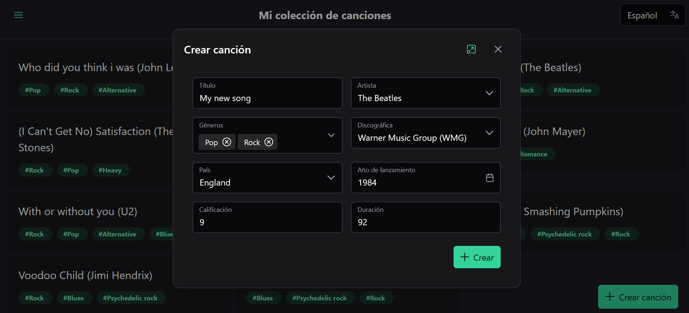

# SequenceERPTI

This project acts as the technical interview for Sequence-ERP.

The objective is to make a frontend application using Angular to manage (in my case), songs that artists have and those artists have companies.

As an extra feature for translations, it will automatically detect your browser preferent language and translate everything up (Only works for :gb: :fr: :es: :de:), if your prefered language is not one of them, the page will set :gb: as the language.

The main problem I had was the tpye management by json-server, was not pretty acurate and made really weird things.

## Project installation

Firstly you will need the following tools installed:

- [Node v22 LTS (v20 should be fine but not tested)](https://nodejs.org/en)
- [Pnpm](https://pnpm.io/)
- [Angular CLI v19](https://angular.dev/tools/cli)

When you already had the prior tools, you can clone the project:

```bash
git clone https://github.com/VICamaraPrg/Sequence-ERP-TI.git
```

After clone it, you can go inside the directory and install the dependencies:

```bash
cd Sequence-ERP-TI
pnpm install
```

To run the project you must run the following command:

```bash
pnpm run start:all
```

That will run the frontend all well as the API and DB in parallel.

However, if you want to start the frontend and the API separatedly:

```bash
pnpm run dev
pnpm run api
```

## Mandatory technical requirements:

- There's no rush as for the project organization as it can escalate quickly.
- Apply the top performance skills to develop that I can handle.
- Freedom to use any UI component library.
- Implement support for language translation.
- Handle loading states (Spinners, loading bars...).

## Extra requirements (optionals and very valuable)

- Implement state management. Either Redux pattern, BehaviorSubjects, signal stores...
- Testing
  - Unit: [Karma / Jasmine] or Jest
  - Integration: [Karma / Jasmine] or Jest
  - E2E: Playwright or Cypress.
- Use any CSS methodology (BEM, Utility) or TailwindCSS.

## What will I be using?

My implementation will use:

- UI Library: PrimeNg.
- State Management: Signal Stores.
- CSS: TailwindCSS.
- i18n: ngx-translate.
- API: json-server (Since we have a ready mocked json)
- Format: Prettier
- Testing:
  - E2E: Due to lack of time, I could not do it.
  - Integration: Due to lack of time, I could not do it.
  - Unit: Jest

## Images





